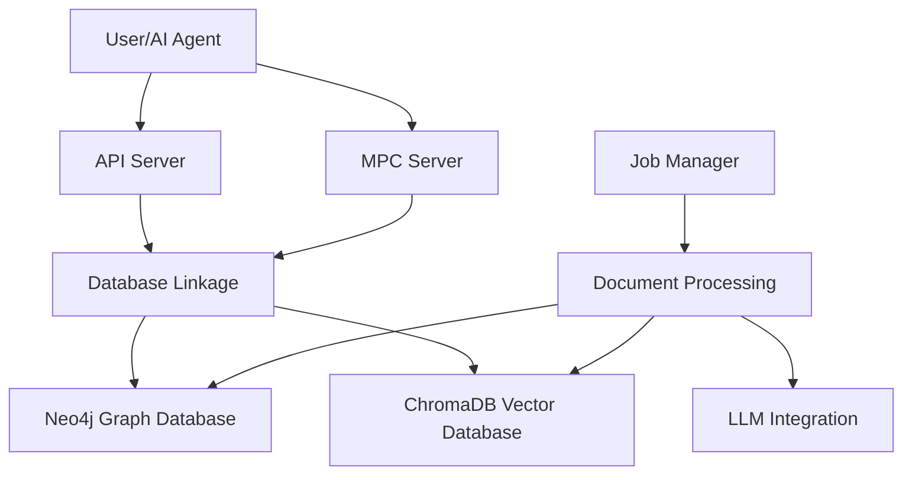
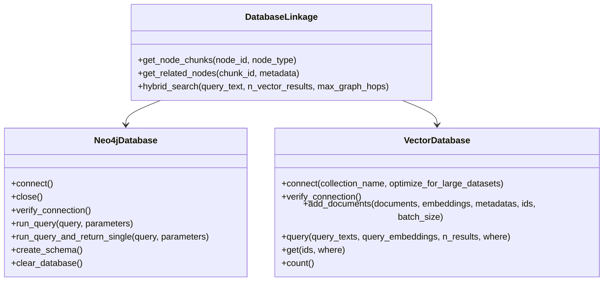
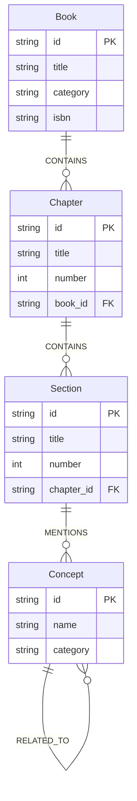
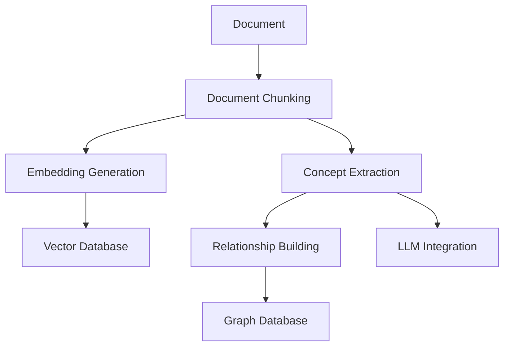
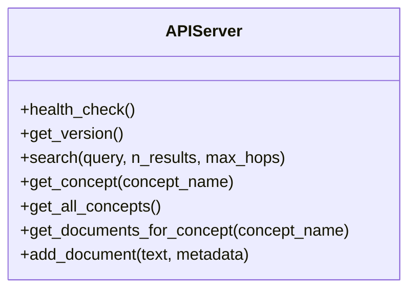
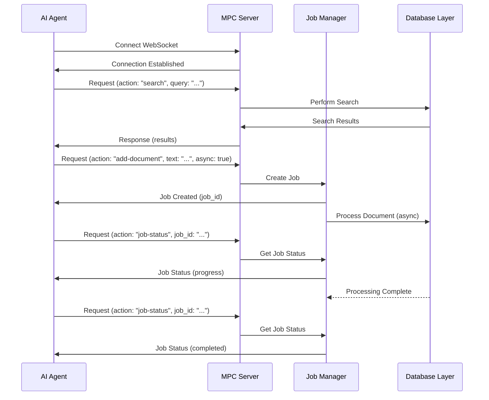
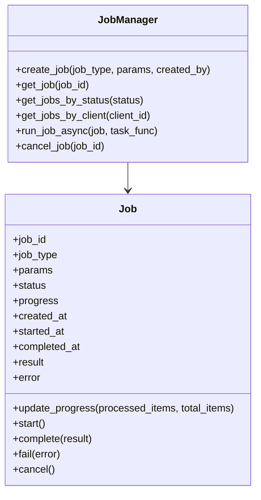
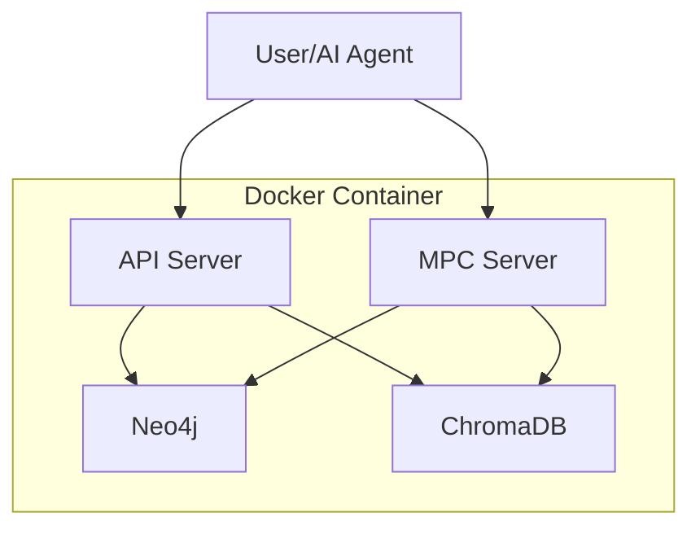
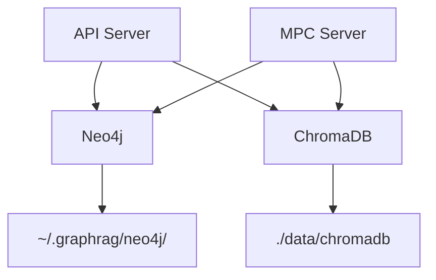

# GraphRAG System Architecture

## 1. System Overview

GraphRAG is a hybrid Retrieval-Augmented Generation system that combines vector embeddings with knowledge graphs to overcome the limitations of traditional embedding-based RAG systems. By explicitly representing semantic connections and contextual relationships between ideas within and across books, GraphRAG enables more sophisticated information retrieval and synthesis.



### 1.1 Key Features

- **Hybrid Search**: Combines vector similarity with graph traversal for more contextually relevant results
- **Concept Extraction**: Identifies key concepts and their relationships from documents
- **Asynchronous Processing**: Handles large batch operations without blocking
- **AI Agent Integration**: Provides tools for AI agents to interact with the system
- **Duplicate Detection**: Prevents adding duplicate documents to the system

### 1.2 Technology Stack

- **Backend**: Python 3.12
- **Graph Database**: Neo4j 5.18.1
- **Vector Database**: ChromaDB 1.0.8+
- **API Server**: Flask
- **MPC Server**: WebSockets
- **LLM Integration**: OpenAI API and local models via LM Studio
- **Containerization**: Docker

### 1.3 System Requirements

- **Hardware**:
  - Minimum: 4GB RAM, 2 CPU cores, 20GB storage
  - Recommended: 8GB+ RAM, 4+ CPU cores, 100GB+ storage for large document collections
- **Software**:
  - Python 3.12 (required for spaCy compatibility)
  - Docker (optional, for containerized deployment)
  - Neo4j 5.18.1+
  - UV package manager (preferred over pip)
- **Network**:
  - Ports 5001 (API), 7688 (Neo4j Bolt), 7475 (Neo4j Browser), 8766 (MPC) must be available
  - Internet connection for LLM API calls (if using OpenAI)

## 2. Component Architecture

### 2.1 Database Layer

The database layer consists of two primary databases:

1. **Neo4j Graph Database**: Stores the knowledge graph with concepts, documents, and their relationships
2. **ChromaDB Vector Database**: Stores document chunks and their embeddings for semantic search



#### 2.1.1 Neo4j Schema



### 2.2 Processing Layer

The processing layer handles document ingestion, chunking, concept extraction, and relationship building:



#### 2.2.1 Document Processing Pipeline

1. **Document Loading**: Parse documents from various formats (PDF, TXT, MD)
2. **Chunking**: Split documents into semantic chunks
3. **Embedding Generation**: Generate embeddings for each chunk
4. **Concept Extraction**: Extract key concepts using NLP and/or LLM
5. **Relationship Building**: Create relationships between concepts and documents
6. **Storage**: Store chunks in ChromaDB and concepts/relationships in Neo4j

### 2.3 API Layer

The API layer provides RESTful endpoints for interacting with the system:



#### 2.3.1 API Endpoints

| Endpoint | Method | Description |
|----------|--------|-------------|
| `/health` | GET | Health check endpoint |
| `/version` | GET | Get application version |
| `/search` | POST | Perform hybrid search |
| `/concepts/<concept_name>` | GET | Get concept information |
| `/concepts` | GET | Get all concepts |
| `/documents/<concept_name>` | GET | Get documents for concept |
| `/documents` | POST | Add a document |

### 2.4 MPC Server

The MPC (Message Passing Communication) server enables AI agents to interact with the system:



#### 2.4.1 MPC Actions

| Action | Description |
|--------|-------------|
| `ping` | Simple ping for connection testing |
| `search` | Hybrid search |
| `concept` | Get concept info |
| `documents` | Get documents for concept |
| `books-by-concept` | Find books mentioning a concept |
| `related-concepts` | Find related concepts |
| `passages-about-concept` | Find passages about a concept |
| `add-document` | Add a single document |
| `add-folder` | Add a folder of documents |
| `job-status` | Get status of a job |
| `list-jobs` | List all jobs |
| `cancel-job` | Cancel a job |

### 2.5 Job Management

The job management system handles asynchronous processing of long-running tasks:



## 3. Deployment Architecture

### 3.1 Docker Deployment

The system can be deployed as a Docker container with all necessary components:



#### 3.1.1 Port Mappings

| Service | Container Port | Host Port |
|---------|----------------|-----------|
| Neo4j Browser | 7474 | 7475 |
| Neo4j Bolt | 7687 | 7688 |
| API Server | 5000 | 5001 |
| MPC Server | 8765 | 8766 |

### 3.2 Local Deployment

The system can also be run locally with Neo4j installed in `~/.local/neo4j/` and data stored in `~/.graphrag/neo4j/`:



## 4. Integration with AI Agents

### 4.1 LangChain Integration

```python
from langchain.agents import initialize_agent, AgentType
from langchain.chat_models import ChatOpenAI
from src.agents.langchain_tools import get_graphrag_tools

# Initialize LangChain components
llm = ChatOpenAI(temperature=0)
tools = get_graphrag_tools(api_url="http://localhost:5001")

# Initialize agent
agent = initialize_agent(
    tools,
    llm,
    agent=AgentType.CHAT_CONVERSATIONAL_REACT_DESCRIPTION,
    verbose=True
)

# Use the agent
agent.run("What does the book 'Deep Learning Fundamentals' say about neural networks?")
```

### 4.2 OpenAI Function Calling

```python
from openai import OpenAI
from src.agents.openai_functions import get_graphrag_functions, get_graphrag_function_map

# Initialize OpenAI client
client = OpenAI()

# Get GraphRAG functions
functions = get_graphrag_functions(api_url="http://localhost:5001")
function_map = get_graphrag_function_map(api_url="http://localhost:5001")

# Use with OpenAI
response = client.chat.completions.create(
    model="gpt-4",
    messages=[{"role": "user", "content": "Find information about neural networks"}],
    functions=functions,
    function_call="auto"
)

# Handle function calling
if response.choices[0].message.function_call:
    function_name = response.choices[0].message.function_call.name
    function_args = json.loads(response.choices[0].message.function_call.arguments)

    # Call the function
    function_response = function_map[function_name](**function_args)
```

## 5. Remaining Work

The following items are still in progress:

1. **MPC Server Issues** (3.6-spec-mpc-server-issues.md): Fix startup failures and improve reliability
2. **LLM Integration** (3.10-spec-llm-integration.md): Consolidate LLM code to use local models properly
3. **API Port Conflict** (3.7-spec-api-port-conflict.md): Resolve port conflicts when multiple instances start
4. **ChromaDB Duplicate Detection** (3.8-spec-chromadb-duplicate-detection.md): Improve duplicate detection
5. **Vector Search Error** (3.9-spec-vector-search-error.md): Fix errors in vector search
6. **Docker Best Practices** (docker-best-practices.md): Implement Docker best practices

## 6. Installation and Setup

### 6.1 Local Installation

```bash
# Clone the repository
git clone https://github.com/yourusername/graphRAG.git
cd graphRAG

# Create and activate virtual environment with Python 3.12
python3.12 -m venv .venv-py312
source .venv-py312/bin/activate

# Install dependencies using UV
uv pip install -r requirements.txt

# Install Neo4j
./scripts/install_neo4j.sh

# Start Neo4j
./scripts/start_neo4j.sh

# Set Neo4j password (first time only)
~/.local/neo4j/bin/neo4j-admin dbms set-initial-password graphrag

# Start the API server
./scripts/start_api_local.sh

# Start the MPC server
./scripts/start_mpc_local.sh
```

### 6.2 Docker Installation

```bash
# Clone the repository
git clone https://github.com/yourusername/graphRAG.git
cd graphRAG

# Build the Docker image
docker build -t graphrag .

# Run the container
docker run -d --name graphrag \
  -p 5001:5000 \
  -p 7475:7474 \
  -p 7688:7687 \
  -p 8766:8765 \
  -v $(pwd)/data:/app/data \
  graphrag
```

### 6.3 Configuration

The system uses environment variables for configuration, which can be set in a `.env` file:

```env
# Neo4j Configuration
NEO4J_URI=bolt://localhost:7687
NEO4J_USER=neo4j
NEO4J_PASSWORD=graphrag
NEO4J_HOME=~/.local/neo4j
NEO4J_DATA_DIR=~/.graphrag/neo4j

# ChromaDB Configuration
CHROMADB_PERSIST_DIRECTORY=./data/chromadb

# LLM Configuration
OPENAI_API_KEY=your_openai_api_key
LLM_ENDPOINT=http://192.168.1.21:1234  # Local LM Studio endpoint
USE_LOCAL_LLM=true

# API Configuration
API_HOST=0.0.0.0
API_PORT=5000

# MPC Configuration
MPC_HOST=0.0.0.0
MPC_PORT=8765
```

## 7. Maintenance and Operations

### 7.1 Backup and Restore

```bash
# Backup Neo4j database
tar -czf neo4j_backup.tar.gz ~/.graphrag/neo4j/data

# Backup ChromaDB
tar -czf chromadb_backup.tar.gz ./data/chromadb

# Restore Neo4j database
tar -xzf neo4j_backup.tar.gz -C ~/.graphrag/

# Restore ChromaDB
tar -xzf chromadb_backup.tar.gz -C ./data/
```

### 7.2 Monitoring

The system provides several endpoints for monitoring:

- `/health`: Health check endpoint
- `/metrics`: Prometheus metrics (if enabled)
- `/jobs`: List all jobs and their status

### 7.3 Logging

Logs are stored in the following locations:

- API Server: `./logs/api.log`
- MPC Server: `./logs/mpc.log`
- Neo4j: `~/.graphrag/neo4j/logs/`
- Job Processing: `./logs/jobs.log`

Log level can be configured in the `.env` file:

```env
LOG_LEVEL=INFO  # DEBUG, INFO, WARNING, ERROR, CRITICAL
```

### 7.4 Troubleshooting

Common issues and solutions:

1. **Neo4j Connection Issues**:
   - Ensure Neo4j is running: `ps aux | grep neo4j`
   - Check Neo4j logs: `cat ~/.graphrag/neo4j/logs/neo4j.log`
   - Verify credentials in `.env` file

2. **ChromaDB Issues**:
   - Check permissions on the persist directory
   - Verify ChromaDB version compatibility

3. **API/MPC Server Issues**:
   - Check for port conflicts
   - Verify the server is running: `ps aux | grep server`
   - Check logs for errors

## 8. Security Considerations

- **Authentication**: The API and MPC servers do not currently implement authentication. For production use, implement API keys or OAuth.
- **Data Privacy**: Documents are stored in plain text. Consider encryption for sensitive data.
- **Network Security**: Use HTTPS/WSS for production deployments.
- **Access Control**: Neo4j uses basic authentication. Ensure strong passwords in production.

## 9. Performance Optimization

- **Scaling Vector Search**: For large collections (>100K documents), consider sharding ChromaDB.
- **Neo4j Indexing**: Create indexes on frequently queried properties:

  ```cypher
  CREATE INDEX ON :Concept(name);
  CREATE INDEX ON :Document(title);
  ```

- **Batch Processing**: Use batch sizes of 100-1000 for optimal performance when adding documents.
- **Memory Management**: Monitor memory usage and adjust JVM settings for Neo4j if needed.

## 10. Detailed API Documentation

### 10.1 REST API Endpoints

#### `GET /health`

Health check endpoint.

**Response:**

```json
{
  "status": "ok",
  "version": "2.0.0",
  "neo4j_connected": true,
  "chromadb_connected": true
}
```

#### `GET /version`

Get application version.

**Response:**

```json
{
  "version": "2.0.0",
  "build_date": "2023-05-08"
}
```

#### `POST /search`

Perform hybrid search.

**Request:**

```json
{
  "query": "neural networks in deep learning",
  "n_results": 5,
  "max_hops": 2
}
```

**Response:**

```json
{
  "results": [
    {
      "text": "Neural networks are a fundamental component of deep learning...",
      "metadata": {
        "document_id": "doc123",
        "title": "Deep Learning Fundamentals",
        "page": 42
      },
      "score": 0.92,
      "source": "vector"
    },
    {
      "text": "The architecture of neural networks consists of layers...",
      "metadata": {
        "document_id": "doc456",
        "title": "Machine Learning Handbook",
        "page": 78
      },
      "score": 0.85,
      "source": "graph",
      "path": ["neural networks", "architecture", "layers"]
    }
  ]
}
```

#### `GET /concepts/<concept_name>`

Get concept information.

**Response:**

```json
{
  "name": "neural networks",
  "category": "machine learning",
  "related_concepts": [
    {"name": "deep learning", "strength": 0.9},
    {"name": "backpropagation", "strength": 0.8},
    {"name": "activation functions", "strength": 0.7}
  ],
  "documents": [
    {"title": "Deep Learning Fundamentals", "id": "doc123"},
    {"title": "Machine Learning Handbook", "id": "doc456"}
  ]
}
```

### 10.2 MPC Protocol

The MPC server uses WebSockets for communication. Messages are JSON objects with the following structure:

**Request:**

```json
{
  "id": "request-123",
  "action": "search",
  "params": {
    "query": "neural networks",
    "n_results": 5
  }
}
```

**Response:**

```json
{
  "id": "request-123",
  "status": "success",
  "result": {
    "results": [
      {
        "text": "Neural networks are a fundamental component...",
        "metadata": {
          "document_id": "doc123",
          "title": "Deep Learning Fundamentals"
        },
        "score": 0.92
      }
    ]
  }
}
```

**Error Response:**

```json
{
  "id": "request-123",
  "status": "error",
  "error": {
    "code": "not_found",
    "message": "Concept not found"
  }
}
```

## 11. Development and Testing

### 11.1 Development Workflow

The GraphRAG project follows a feature-branch workflow:

1. **Branch Creation**:

   ```bash
   # Ensure you're on the main branch and it's up to date
   git checkout main
   git pull

   # Create a new branch with appropriate naming
   git checkout -b feature-new-feature     # For new features
   git checkout -b task-specific-task      # For specific tasks
   git checkout -b bug-issue-description   # For bug fixes
   ```

2. **Development Process**:
   - Make incremental changes with frequent commits
   - Follow the coding standards (see below)
   - Update tests as you develop
   - Document new features or API changes

3. **Code Review and Merge**:

   ```bash
   # Before submitting for review, run linting
   source .venv-py312/bin/activate
   ruff check src/
   ruff check scripts/

   # Run tests
   pytest tests/

   # Commit final changes
   git add .
   git commit -m "Descriptive commit message"

   # Push to remote
   git push origin feature-new-feature

   # Create a pull request on GitHub
   # After approval, merge to main
   git checkout main
   git merge feature-new-feature
   git tag -a v1.2.3 -m "Version 1.2.3"
   git push --tags
   ```

### 11.2 Coding Standards

- **Python Style**: Follow PEP 8 guidelines
- **Docstrings**: Use Google-style docstrings
- **Type Hints**: Use type hints for all function parameters and return values
- **Linting**: Use ruff for linting and formatting
- **Imports**: Organize imports in the following order:
  1. Standard library imports
  2. Third-party library imports
  3. Local application imports

Example:

```python
# Standard library
import os
import sys
from typing import List, Dict, Optional

# Third-party libraries
import numpy as np
from neo4j import GraphDatabase
import chromadb

# Local application
from src.database.neo4j_db import Neo4jDatabase
from src.utils.logger import get_logger
```

### 11.3 Testing Strategy

The GraphRAG system uses pytest for testing. Tests are organized into the following categories:

1. **Unit Tests**: Test individual components in isolation
2. **Integration Tests**: Test interactions between components
3. **End-to-End Tests**: Test complete workflows
4. **Performance Tests**: Test system performance under load

#### Running Tests

```bash
# Activate virtual environment
source .venv-py312/bin/activate

# Run all tests
pytest

# Run specific test categories
pytest tests/unit/
pytest tests/integration/
pytest tests/e2e/
pytest tests/performance/

# Run tests with coverage
pytest --cov=src tests/

# Generate coverage report
pytest --cov=src --cov-report=html tests/
```

#### Test Structure

```text
tests/
├── unit/
│   ├── test_neo4j_db.py
│   ├── test_vector_db.py
│   └── ...
├── integration/
│   ├── test_database_linkage.py
│   ├── test_document_processing.py
│   └── ...
├── e2e/
│   ├── test_search_workflow.py
│   ├── test_document_addition.py
│   └── ...
└── performance/
    ├── test_search_performance.py
    ├── test_processing_performance.py
    └── ...
```

### 11.4 Complete Workflow Examples

#### Example 1: Adding Documents and Searching

```python
import os
from src.database.neo4j_db import Neo4jDatabase
from src.database.vector_db import VectorDatabase
from src.processing.document_processor import DocumentProcessor
from src.search.hybrid_search import HybridSearch

# Initialize databases
neo4j_db = Neo4jDatabase()
vector_db = VectorDatabase()

# Initialize document processor
processor = DocumentProcessor(neo4j_db, vector_db)

# Add a document
document_path = "/path/to/document.pdf"
job = processor.process_document(document_path)

# Wait for processing to complete
while not job.is_complete():
    print(f"Processing: {job.progress}%")
    time.sleep(1)

# Initialize search
search = HybridSearch(neo4j_db, vector_db)

# Perform search
results = search.search("neural networks in deep learning", n_results=5, max_hops=2)

# Display results
for result in results:
    print(f"Text: {result['text'][:100]}...")
    print(f"Source: {result['source']}")
    print(f"Score: {result['score']}")
    print(f"Document: {result['metadata']['title']}")
    print("---")
```

#### Example 2: Using the MPC Server from a Client

```python
import asyncio
import json
import websockets

async def graphrag_client():
    uri = "ws://localhost:8765"

    async with websockets.connect(uri) as websocket:
        # Ping to test connection
        await websocket.send(json.dumps({
            "id": "ping-1",
            "action": "ping"
        }))

        response = await websocket.recv()
        print(f"Ping response: {response}")

        # Add a document
        await websocket.send(json.dumps({
            "id": "add-doc-1",
            "action": "add-document",
            "params": {
                "path": "/path/to/document.pdf",
                "async": True
            }
        }))

        response = json.loads(await websocket.recv())
        job_id = response["result"]["job_id"]

        # Check job status
        while True:
            await websocket.send(json.dumps({
                "id": "job-status-1",
                "action": "job-status",
                "params": {
                    "job_id": job_id
                }
            }))

            status_response = json.loads(await websocket.recv())
            if status_response["result"]["status"] == "completed":
                break

            print(f"Progress: {status_response['result']['progress']}%")
            await asyncio.sleep(2)

        # Perform search
        await websocket.send(json.dumps({
            "id": "search-1",
            "action": "search",
            "params": {
                "query": "neural networks",
                "n_results": 5
            }
        }))

        search_response = json.loads(await websocket.recv())
        for result in search_response["result"]["results"]:
            print(f"Text: {result['text'][:100]}...")
            print(f"Score: {result['score']}")
            print("---")

# Run the client
asyncio.run(graphrag_client())
```

### 11.5 Performance Benchmarks

The GraphRAG system has been benchmarked on various datasets and hardware configurations. Here are the key performance metrics:

#### Document Processing

| Document Type | Size | Processing Time | Memory Usage |
|---------------|------|-----------------|--------------|
| PDF (text)    | 10 MB | 15-20 seconds   | ~200 MB      |
| PDF (complex) | 10 MB | 30-45 seconds   | ~300 MB      |
| Markdown      | 1 MB  | 3-5 seconds     | ~100 MB      |
| Text          | 1 MB  | 2-3 seconds     | ~100 MB      |

**Note:** Measured on a system with 4 CPU cores and 8GB RAM

#### Search Performance

| Dataset Size | Query Type | Response Time | Memory Usage |
|--------------|------------|---------------|--------------|
| 100 documents | Vector only | 50-100 ms     | ~150 MB      |
| 100 documents | Hybrid      | 100-200 ms    | ~200 MB      |
| 1000 documents | Vector only | 100-200 ms    | ~300 MB      |
| 1000 documents | Hybrid      | 200-400 ms    | ~400 MB      |
| 10000 documents | Vector only | 200-500 ms    | ~1 GB        |
| 10000 documents | Hybrid      | 500-1000 ms   | ~1.2 GB      |

**Note:** Measured on a system with 4 CPU cores and 8GB RAM

#### Scaling Characteristics

- **CPU Scaling**: Processing performance scales almost linearly with CPU cores up to 8 cores
- **Memory Requirements**:
  - Base system: ~500 MB
  - Per 1000 documents: ~300 MB additional
- **Storage Requirements**:
  - Neo4j database: ~20% of original document size
  - ChromaDB: ~30% of original document size

## 12. Conclusion

The GraphRAG system provides a powerful hybrid approach to information retrieval and synthesis by combining vector embeddings with knowledge graphs. Its modular architecture allows for easy integration with AI agents and scalable processing of large document collections.
